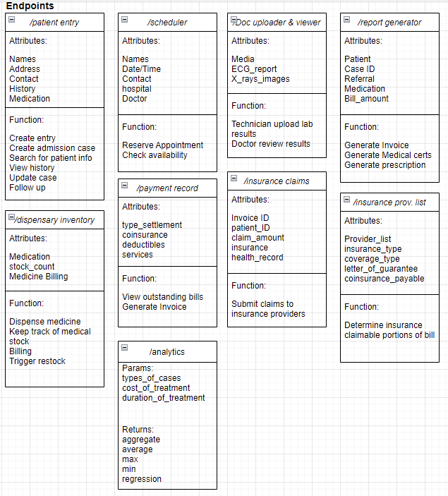
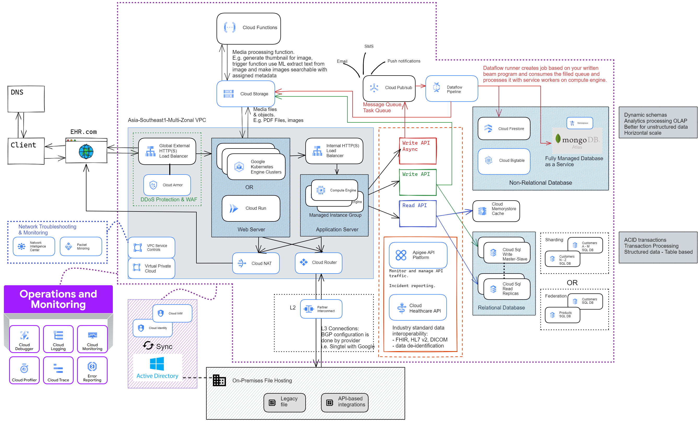
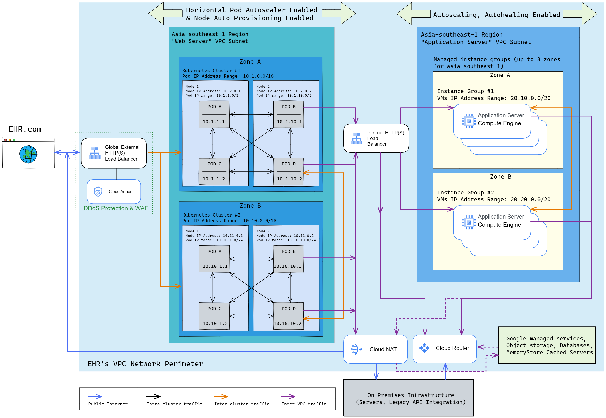

# Designing a solution for an Electronic Health Record Software company

The case study is described in this [link](https://services.google.com/fh/files/blogs/master_case_study_ehr_healthcare.pdf) 

Some technologies mentioned are google's proprietary and full list of services summary can be found [here](https://cloud.google.com/terms/services) 

This is a rundown of my approach to system design for this case.

Evaluation of given problem statement as follows:
## 1.1 Business Evaluation
|Online health record site|Core Values|Immediate business goals|
|-|-|-|
|- Rapid industry - business growing exponentially|-Provide highly available services to customers - Maintain regulatory compliance - Stay current on industry trends - be more organized - secure data & privacy|- be more organized, streamline - able to scale environment while adapting their disaster recovery plan - decrease cost in expansion|

## 1.2 Technical Evaluation
| Existing Environment | Technical Watchpoints | Possible Solutions |
|:-|:-|:-|
| EHR’s software and data is currently hosted in multiple colocation facilities. | Lease is about to expire in one of the data centres. Migration timeline may be tight | - Host and deploy application nearest to your customer in the region itself. - Hybrid computing (partner interconnect is sufficient) - Google Database Migration for SQL DBs - Storage Transfer service of object transfer. |
| Customer-facing applications are web-based, and many have recently been containerized to run on a group of Kubernetes clusters. |  Need to run in cloud with integration w/ on-prem systems | - Migrate to GKE clusters. Images can be built and stored with Google Cloud Build & Artifact Registry, respectively. - Cloud Run |
| Data is stored in a mixture of relational and non-relational databases.  | size of data to be migrated | - Cloud SQL (regional service)  - NoSQL : Firestore , MongoDB atlas  - MemoryStore Cache Servers - Distributed Redis Servers in GKE Clusters |
| EHR is hosting several legacy file- and API-based integrations with insurance providers on-premises.  | These systems are scheduled to be replaced over the next several years. | - Hybrid: VPN , Interconnect , API  - API management:Apigee, cloud endpoints (cloud native) - Integration: API gateway - Migration: Stratazone , velostrata - Anthos for containerization - Storage transfer service - Database migration service  - Transfer appliance - Bigquery DTS |
| Users are managed via Microsoft Active Directory.  |  | Cloud Identity, GCDS , CLOUD IAM , Managed Microsoft AD, IAP, Google Workspace  |
| Monitoring is currently being done via various open source tools. Alerts are sent via email and are often ignored |  | - Cloud Operation suite - Cloud monitoring  - Cloud Logging  - Cloud Trace - Cloud Error reporting  - Cloud debugger - Cloud profiler - Prometheus |

---

## 2. Constraints & Assumptions
### **Function of application**
Not much detail is solicited from EHR due to the secrecy of their work by developers. But they gave a general overview of the available endpoints (class representations) of their healthcare record application in the diagram below. For simplicity's sake, we’ll not go through the relationships in between each class of functions and assume each class has the typical relations (association, inheritance, aggregation…etc) in a UML diagram with each other.Endpoints for application: 

For example, in order for “/report generator” to generate prescriptions for the patient, it needs to check if “/patient entry” is updated to dispense which type of medications. Also it checks for “/dispensary inventory” for stock_count before prescribing and triggering the dispensary to prepare the prescription. Lastly the generated prescription can be updated into the total bill of the patient in “/payment record”

### **Assumptions**
- International presence. 3 Colocation Data Centers at New York, London, Singapore (all not connected for regulatory compliance)
- What we have in Singapore:
    - On-prem Data centre at singapore HQ (use Partner interconnect)
    - existing DC at Keppel data centre move to google cloud     
    - No other DC left in Singapore after lease expire, all move to google cloud
- This VPC network  in the cloud serves a single geographic region of Singapore.
- Servers in other regions are segregated by VPC networks & traffic is mapped and routed individually by the global load balancer.
- Traffic is not evenly distributed. Peaks over certain periods or day or month.
- Need for relational data (ACID transactions) and also non-relational
- scale from existing users from 10,000 to double or triple of existing. (10 hospitals, 10 MNC, 10 insurance prov, each org 200+ users)
- Patient cases annual count assumed at 500,000 files. (Singapore's 2020 Acute hospitals patient admissions is estimated at 500,000) 
- Case files with retention period of 10 years in DB and subsequently kept in archival storage for lifetime (MOH 2015 Guideline advocate for at least 6 years retention period)
- Records more than 10 years old will be archived into object storages and a backup made to on-premises storage.
- 1 million writes per month (40,000 cases x 25 writes)
- 25 million reads per month
- 25:1 read to write ratio
- average 10kb data per write to DB
- average 10MB media upload per case to object storage

### **Estimated usage**
- 10 GB of new data per month
- 10kb per write * 1 million writes per month
- 600GB of new data in next 5 years
- Assume most UPDATE/writes are from existing cases instead of writes to new ones.
- 2 TB of existing data on DB (10 years worth)
- 0.4 writes per second on average
- 10 reads per second on average
- 400 GB of new media objects per month
- 10MB upload * average 40,000 cases per month
- 24 TB of media over next 5 years
- 50 TB of existing media on object storage (10 years worth)

---
## 3. Sketching the design diagram
Initial design diagram conceptualised as follows: 

---
## 4. Compute: Web Servers & the Application Servers
Initial design diagram for computing will go for GKE Standard Cluster for their web servers and Managed instance groups for their application servers. 

---
## 5. Works in Progress....