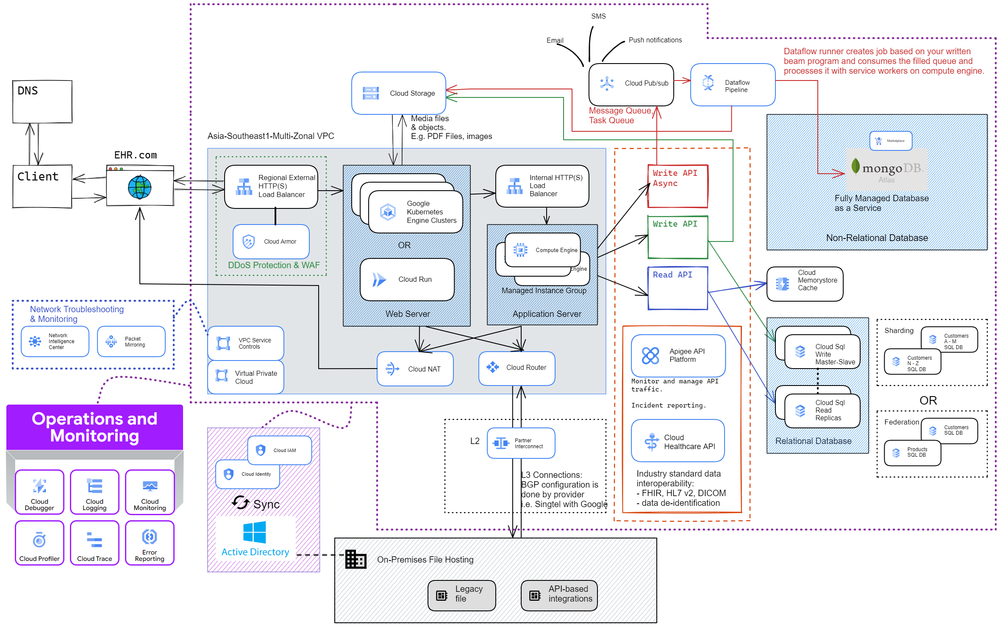

# Designing a solution for an Electronic Health Record Software company

The case study is described in this [link](https://services.google.com/fh/files/blogs/master_case_study_ehr_healthcare.pdf) 

Some technologies mentioned are google's proprietary and full list of services summary can be found [here](https://cloud.google.com/terms/services) 

This is rather a design brief rather than an actual demo. Apologies!
This is a rundown of my approach to system design for this case.

Evaluation of given problem statement as follows:
## 1.1 Business Evaluation
|Online health record site|Core Values|Immediate business goals|
|-|-|-|
|- Rapid industry - business growing exponentially|-Provide highly available services to customers - Maintain regulatory compliance - Stay current on industry trends - be more organized - secure data & privacy|- be more organized, streamline - able to scale environment while adapting their disaster recovery plan - decrease cost in expansion|

## 1.2 Technical Evaluation
| Existing Environment | Technical Watchpoints | Possible Solutions |
|:-|:-|:-|
| EHR’s software and data is currently hosted in multiple colocation facilities. | Lease is about to expire in one of the data centres. Migration timeline may be tight | - Host and deploy application nearest to your customer in the region itself. - Hybrid computing (partner interconnect is sufficient) - Google Database Migration for SQL DBs - Storage Transfer service of object transfer. |
| Customer-facing applications are web-based, and many have recently been containerized to run on a group of Kubernetes clusters. |  Need to run in cloud with integration w/ on-prem systems | - Migrate to GKE clusters. Images can be built and stored with Google Cloud Build & Artifact Registry, respectively. - Cloud Run |
| Data is stored in a mixture of relational and non-relational databases.  | size of data to be migrated | - Cloud SQL (regional service)  - NoSQL : Firestore , MongoDB atlas  - MemoryStore Cache Servers - Distributed Redis Servers in GKE Clusters |
| EHR is hosting several legacy file- and API-based integrations with insurance providers on-premises.  | These systems are scheduled to be replaced over the next several years. | - Hybrid: VPN , Interconnect , API  - API management:Apigee, cloud endpoints (cloud native) - Integration: API gateway - Migration: Stratazone , velostrata - Anthos for containerization - Storage transfer service - Database migration service  - Transfer appliance - Bigquery DTS |
| Users are managed via Microsoft Active Directory.  |  | Cloud Identity, GCDS , CLOUD IAM , Managed Microsoft AD, IAP, Google Workspace  |
| Monitoring is currently being done via various open source tools. Alerts are sent via email and are often ignored |  | - Cloud Operation suite - Cloud monitoring  - Cloud Logging  - Cloud Trace - Cloud Error reporting  - Cloud debugger - Cloud profiler - Prometheus |

---

## 2. Constraints & Assumptions
### **Function of application**
Not much detail is solicited from EHR due to the secrecy of their work by developers. But they gave a general overview of the available endpoints (class representations) of their healthcare record application in the diagram below. For simplicity's sake, we’ll not go through the relationships in between each class of functions and assume each class has the typical relations (association, inheritance, aggregation…etc) in a UML diagram with each other.Endpoints for application: 

For example, in order for “/report generator” to generate prescriptions for the patient, it needs to check if “/patient entry” is updated to dispense which type of medications. Also it checks for “/dispensary inventory” for stock_count before prescribing and triggering the dispensary to prepare the prescription. Lastly the generated prescription can be updated into the total bill of the patient in “/payment record”

### **Assumptions**
- International presence. 3 Colocation Data Centers at New York, London, Singapore (all not connected for regulatory compliance)
- What we have in Singapore:
    - On-prem Data centre at singapore HQ (use Partner interconnect)
    - existing DC at Keppel data centre move to google cloud     
    - No other DC left in Singapore after lease expire, all move to google cloud
- This VPC network  in the cloud serves a single geographic region of Singapore.
- Servers in other regions are segregated by VPC networks & traffic is mapped and routed individually by the global load balancer.
- Traffic is not evenly distributed. Peaks over certain periods or day or month.
- Need for relational data (ACID transactions) and also non-relational
- scale from existing users from 10,000 to double or triple of existing. (10 hospitals, 10 MNC, 10 insurance prov, each org 200+ users)
- Patient cases annual count assumed at 500,000 files. (Singapore's 2020 Acute hospitals patient admissions is estimated at 500,000) 
- Case files with retention period of 10 years in DB and subsequently kept in archival storage for lifetime (MOH 2015 Guideline advocate for at least 6 years retention period)
- Records more than 10 years old will be archived into object storages and a backup made to on-premises storage.
- 1 million writes per month (40,000 cases x 25 writes)
- 25 million reads per month
- 25:1 read to write ratio
- average 10kb data per write to DB
- average 10MB media upload per case to object storage

### **Estimated constant usage**
- 10 GB of new data per month
    - 10kb per write * 1 million writes per month
    - 600GB of new data in next 5 years
    - Assume most UPDATE/writes are from existing cases instead of writes to new ones.
- 2 TB of existing data on DB (10 years worth)
- 0.4 writes per second on average
- 10 reads per second on average
- 400 GB of new media objects per month
    - 10MB upload * average 40,000 cases per month
    - 24 TB of media over next 5 years
- 50 TB of existing media on object storage (10 years worth)

---
## 3. Sketching the design diagram
Initial design diagram conceptualised as follows: 

Second revision diagram conceptualised as follows: 

---
## 4. Compute: Web Servers & the Application Servers
Initial design diagram for computing will go for GKE Standard Cluster for their web servers and Managed instance groups for their application servers. 

### Kubernetes Cluster for Web Server
- Google Kubernetes Engine provides the best solution for managing the apps with  advanced configuration flexibility over the cluster's underlying infrastructure. 
- Cater to stateless and stateful applications with options for zonal or regional persistent disks.
- GKE Regional clusters provide high availability. They are able to replicate the cluster's control plane and nodes across multiple zones within a single region.
- GKE's cluster autoscaler automatically resizes the number of nodes in a given node pool, based on the demands of EHR’s workloads. 
- Deployments are well-suited for stateless applications and scalable automatically with Horizontal Pod Autoscaler, with Rolling Updates to keep disruption minimal.
- For cluster networking, EHR has the choice to isolate the network into private clusters. Private clusters assign internal addresses to Pods and nodes, and workloads are completely isolated from public networks.
- Kubernetes RBAC is built into Kubernetes, and grants granular permissions to objects within Kubernetes clusters. Use with namespaces for in-depth defence.
- Resilience from single zone failure: Regional clusters are available across a region rather than a single zone within a region. If a single zone becomes unavailable, your control plane and your resources are not impacted.
- Continuous control plane upgrades, control plane resizes, and reduced downtime from control plane failures. With redundant replicas of the control plane, regional clusters provide higher availability of the Kubernetes API, so you can access your control plane even during upgrades. [Link](https://cloud.google.com/kubernetes-engine/docs/concepts/security-overview)
- Apply Ingress Resource on top of External HTTP(S) Load Balancer for policies control.
- Usable with service meshes on top of Ingress Resource, i.e. Istio, Anthos.

### Managed Instance Groups for Application Server
- High Availability:
    - MIG automatically recreates that VM in accordance with the original instance's specification template
    - Application-based autohealing recreates VMs that are periodically checked to be unhealthy.
    - Multiple zones coverage to protect against zonal failures and workload load balanced across two zones.
- Autoscaling can be enabled to meet demands to scale resources horizontally.
- Support for stateful workloads with customizable persistent disk storages.
- Simplify application deployment by deploying containers to instances.
- Portability: You can detach boot disks from your VM instance and attach new boot disks, which helps simplify the process of repairing boot disks.
- Images from on-prem environments can be imported into Cloud Storage Bucket and be used on VMs. [Guide](https://cloud.google.com/compute/docs/import/requirements-export-import-images)
- Running VM workloads on Sole-tenant nodes for separating environments. [Overcommitting](https://cloud.google.com/compute/docs/nodes/sole-tenant-best-practices) CPUs on sole-tenant VMs for optimal utilisation of resources.

### Trade-offs
- Kubernetes Cluster for Web Server
    - Round-trip latency between zones within a single region might be higher than that between resources in a single zone.
    - Egress traffic between zones in the same region is chargeable. [Pricing](https://cloud.google.com/vpc/network-pricing)
    - Overprovisioning for availability and to scale faster incur extra costs.
		
- Managed Instance Groups for Application Server
    - Deploying node groups across multiple zones lets you improve availability, but can result in lower resource utilisation.
    - Egress traffic between zones in the same region is chargeable. [Pricing](https://cloud.google.com/vpc/network-pricing)
    - Depending on licensing requirements of the operating systems and software that you're planning to run, node autoscaling and your choice of maintenance policy can impact your licensing cost and availability. [Link](https://cloud.google.com/compute/docs/nodes/sole-tenant-best-practices#byol_and_per-core_licensing)

### Alternatives
- Cloud Run (fully-managed) lets you run stateless containers in a fully-managed environment. If EHR have stateless applications and wish to reduce overhead cost in managing those applications, they can consider using Cloud Run.

- Preemptible VMs can be used to handle workloads such as data batch processing while saving costs when it is not needed. Preemptible instances last up to 24 hours, and are preempted gracefully—your application has 30 seconds to exit correctly. 

### Additional Talking points
- Choosing the right machine type to handle incoming requests. Optimally EHR would want enough computing power to handle traffic and spikes without wasting additional resources.

- For Kubernetes clusters, choosing the right instance type for your cluster has dramatic consequences on your scaling strategy. The right machine type should be decided based on testing, and then optimised subsequently for designing their scaling strategy.

---
## 5. Networks

### Static IP & DNS
- The frontend load balancer’s IP provides a public endpoint whose IP doesn't change on reboot.
- Helps with failover, just point the domain to a new IP.
- Use CloudDNS to map the domain to the instance's public IP. EHR can have the option to migrate from an existing provider or [create a new zone in CloudDNS.](https://cloud.google.com/dns/docs/tutorials/create-domain-tutorial/?hl=en#set-up-domain) [Pricing Guide](https://cloud.google.com/dns/pricing)

### Load Balancing & Routing

- Regional External HTTP(S) load balancer is chosen to manage regional traffic from frontend facing public internet. 
- When configuring the Kubernetes cluster, the Front end service would be exposed as a LoadBalancer when defining the service.
- Traffic from any external IP address can access your Service by default. You can restrict which IP address ranges can access endpoints within your cluster, by configuring the loadBalancerSourceRanges option when configuring the Service.
- HTTP(S) load balancers use an Ingress resource rather than a forwarding rule to route traffic to a Kubernetes node. When you create the Ingress resource, GKE provides an external HTTP(S) load balancer in the Google Cloud project. The load balancer sends a request to a node's IP address at the NodePort.
- If your service uses the HTTP(S) load balancer, you can use a Google Cloud Armor security policy to limit which external IP addresses can access your Service and which responses to return when access is denied because of the security policy. 
- You can configure Cloud Logging to log information about these interactions. If a Google Cloud Armor security policy is not fine-grained enough, you can enable the Identity-Aware Proxy on your endpoints to implement user-based authentication and authorization for your application. Visit the detailed tutorial for configuring IAP for more information.
- A URL map can map and direct traffic to backend services or backend buckets.

### Hybrid Connectivity
- For the right balance, i recommend [L2 or L3 Partner interconnect](https://cloud.google.com/network-connectivity/docs/interconnect/concepts/partner-overview) for balalance of speed and security but comes at a cost.

Google's [documentation guide](https://cloud.google.com/network-connectivity/docs/interconnect/tutorials/partner-creating-999-availability) for partner interconnect:
- Layer 2 versus Layer 3 connectivity:
For L2 connections, you must configure and establish a BGP session between your Cloud Routers and on-premises routers for each VLAN attachment that you create. The BGP configuration information is provided by the VLAN attachment after your service provider has configured it.

- For Layer 3 connections, your service provider establishes a BGP session between your Cloud Routers and their edge routers for each VLAN attachment. You don't need to configure BGP on your on-premises router. Google and your service provider automatically set the correct configurations.

Shown below is the connection diagram depicted from google for partner interconnect with a L2 connection. Client side have to configure the BGP protocols for the connection. 
 
Shown below is partner interconnect with a L3 connection. Client side have to configure the BGP protocols for the connection. 
 

### Trade-Offs
- Regional HTTP(S) load balancers have limited Network endpoint groups and do not support hybrid NEGs. In other word if EHR is still hosting web applications on-prem then this LB will not be able to serve.
- How fast Singtel (ISP/ Provider) will be able to set up the partner interconnect connection is out of our control.
- An interconnect connection is costlier than peering and VPN connection but offers lower latency and security.

### Alternatives
- Load Balancers:
Consider external Global Load balancing with more NEGs. This would be great for connecting to other data centres around the world. However, one would have to pay extra attention to configurations to meet with regional authorities’ data compliance.

- Hybrid Connectivity with on-prem endpoint:
    * Direct Peering: Direct exchange of your network’s routing information with google’s edge network. Uses hot potato routing. Better latency than carrier peering.
    * Carrier Peering: Your network will be peered with the providers’ network and then only to google’s. A few extra hops increases latency.
    * Using a VPN connection or a dual tunnel high availability VPN connection. However it is constrained by if data at transport is encrypted at client’s application end. Also consideration for a lower payload limit of 1460 MTU, which increases latency back to back.
    * Last resort is to use VPN for connecting remotely for short processes such as troubleshooting and maintenance.

### Additional Talking Points
- Firewalls: Open up only necessary ports. Prevent the web server from initiating outbound connections. Allow the web server to respond to incoming requests from:
    - 80 for HTTP
    - 443 for HTTPS
    - 22 for SSH to only whitelisted IPs

---
## 6. Storage
### SQL Servers
SQL server architecture using managed Cloud SQL. Google's Cloud SQL offers a setup of Master-Slave DB configuration with a standby instance (preferably in another zone) for failover. As shown below: 
 

- Use of CloudSQL managed services reduces the overhead of configuring own servers in VMs, addresses the scalability and availability issues with less overhead.
- If an HA-configured instance becomes unresponsive, Cloud SQL automatically switches to serving data from the standby instance as shown below. Process of failover initiation is describe in this [guide](https://cloud.google.com/sql/docs/mysql/high-availability#normal). 
 

- Failover is initiated as long as the primary instance must be in a normal operating state and the secondary zone and standby instance must both be in a healthy state.
- Customer data can migrate easily from on-prem to CloudSQL using Database Migration Service. Replicate data continuously for minimal downtime migrations for MySQL as well as MS SQL Server).

### Memory Cache servers
Using a [high availability configuration](https://cloud.google.com/memorystore/docs/redis/high-availability) shown as below. It prevents single point of failure of memory cache servers. The diagram below shows a Standard Tier with read replicas enabled). 
 

Changes made to the data on the primary node are copied to the replica using the Redis asynchronous replication protocol. Due to the asynchronous nature of replication, a replica can lag behind the primary node depending on the write rate on the primary.

### NoSQL Servers
- Since EHR has been using MongoDB's existing database, it would be easy to just migrate the database to Google Cloud with its managed service MongoDB Atlas in the marketplace.
- Managed clusters are built for resilience with self-healing, cross-cloud failover, with a 99.995% uptime guarantee.
- MongoDB NoSQL servers are great for loading processed batch data with flexible document schemas, horizontally scalable, & better analytics. As shown below: 
 

### Object storage (Blobstore):
- Since healthcare data would need to remain in the same region, we are only able to use a single region cloud storage. However, data and metadata are stored redundantly across zones, starting with the initial write. No writes are lost upon a zone becoming unavailable.
- he other consideration is having different buckets for files with different age, below is just an example of the retention period in each bucket for objects of different age. Luckily we dont have to manually do this, this is achievable with Google's cloud storage object lifecycle management managed service which will move the objects based on the policy set. 
 

### Trade-Offs
- Cloud SQL server:
    - More read replicas creates more latency and failure points.
    - [Binary logging](https://dev.mysql.com/doc/refman/8.0/en/binary-log.html) must be enabled which requires [point-in-time recovery](https://cloud.google.com/sql/docs/mysql/backup-recovery/pitr#disk-usage) to be enabled.
    - As such binary logging will affect the replication write service which induces performance reduction.

- Redis Memory cache servers:
    - It is possible for replicas to lag behind especially when the write rate is very high. Thus it could be stale information affecting your applications performance and accuracy.

- MongoDB NoSQL server:
    - Stores key names for each value pair. Therefore, all this results in large usage of memory.
    - Unlike a relational database, MongoDB does not support joins.
    - MongoDB does not support document size of more than 16 MB.
    - MongoDB Atlas charges a monthly subscription fee for managing availability and scalability.

- Cloud Storage (blobstore):
    - Possibility of regional failure in a single region. Have to minimise loss with decreased Recovery Time Objective and Recovery Point Objective.

### Alternatives
- Installing the SQL DB in Virtual Machines manually, mounting persistent disks & etc.
- Consider Memorystore for MemCached.
- Consider Firestore for NoSQL servers.
- Hosting a second blobstore at Amazon S3 for redundancy.

### Additional Talking Points
- SQL server: Sharding or Federation of data in DB.Depending on the data structures and application logic. EHR have to test either option to determine which provides lowest latency. 
 

- SQL server: Achieve higher scalability to meet user demands, can consider to scale the SQL read replicas horizontally as follows: 
 

- Managed SQL vs SQL in VM MIG: Versatility versus scalability.
- MongoDB Atlas vs self-managed nonSQL server on VM MIG: Versatility versus scalability & reliability.
- Cloud storage migration takes time. 
 

---
### That's it for now.

Definitely a lot of things i have to dive deep to explore the options. But this is what i had prepared for my team presentation. Worth a revisit some time soon.

---

